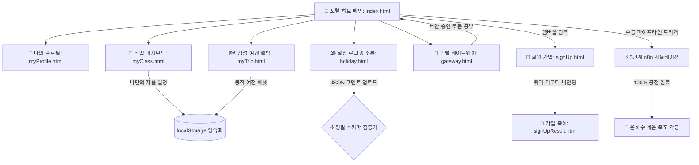

# 🏡 SKALA Portal Hub

> **"책으로만 배우는 정체된 기술보다, 매일 살아 움직이는 파이프라인을 설계하는 즐거움을 나눕니다."**  
> 데이터와 일상, 그리고 따뜻한 감성이 머무르는 안성민의 개인 포털 대시보드 공간에 오신 것을 환영해요! 😊

---

## 🌟 프로젝트 소개

**SKALA Portal Hub**는 데이터 엔지니어를 꿈꾸는 안성민의 치열한 기술적 도전과 소박하고 따뜻한 일상을 조화롭게 담아낸 통합 대시보드 플랫폼입니다.

기존의 딱딱하고 정형화된 포트폴리오 형식에서 벗어나, 방문하시는 모든 분들이 편안한 분위기 속에서 직접 파이프라인을 기동해 보고, 일정을 편집하며, 소통할 수 있는 **'감성적 인터랙티브 놀이터'**로 설계되었습니다.

---

## 🗺️ 포털 서비스 아키텍처 (Mermaid 구조도)

포털 허브가 제공하는 다양한 서비스 채널과 유기적인 데이터 흐름을 한눈에 살펴보실 수 있습니다.

---

## 🛋️ 채널별 인터랙션 & 수줍은 자랑거리

### 🏡 1. 포털 메인 허브 (`index.html`)

- **⚡ n8n 실시간 파이프라인 오케스트레이션**: 우측의 수동 트리거 버튼을 누르면 크론, API 수집, 정규표현식 필터링, JSONL 정형화, 달력 캐싱까지의 5대 공정이 순차적으로 진행 바와 함께 가동됩니다. 완료 시 사방으로 흩날리는 환상적인 **네온 축포 세레머니**가 펼쳐집니다!
- **🔢 난수 매칭 게임 (UpDown)**: **Easy(1~50, 10회)**, **Normal(1~100, 7회)**, **Hard(1~150, 5회)** 난이도 필터를 장착해 누구나 가볍게 두뇌 회전을 즐길 수 있습니다. F12 개발자 도구 콘솔에 비밀 난수가 숨겨져 있는 귀여운 치트키도 있어요!
- **📊 학점 변환기**: 다중 과목 추가/삭제와 학점(GPA) 변환을 동적으로 처리하며, 만점 달성 시 특별한 입자 축하 효과가 기동됩니다.
- **🎒 가방 캐리어 패킹**: 아이템 이름별로 전설(Legendary)/에픽(Epic)/희귀(Rare)/일반(Common) 등급을 매겨, 가방에 짐을 실을 때마다 독특한 **네온 글로우 조명**이 켜집니다.

### 👤 2. 나의 프로필 명세 (`myProfile.html`)

- **진솔한 엔지니어링 에세이**: 데이터 파이프라인 설계에 대한 진지한 철학과, 장애 극복 스토리, 성민의 따뜻한 라이프스타일을 담았습니다.
- **수평선 라이트박스 갤러리**: 취미인 인형뽑기, 맛집 탐방, 반려동물 자랑, 풍경 사진을 담은 카드로 클릭 시 화면 중앙에 포근하게 원본 스케일로 펼쳐집니다.

### 🗺️ 3. 감성 여행 앨범 (`myTrip.html`)

- **Virtual Deck 싱글 페이지**: 복잡한 화면 이동 없이 한 화면 안에서 3개국(베트남, 프랑스, 이탈리아)의 여정을 슬라이드 덱처럼 부드럽게 감상합니다.
- **나만의 여정 실시간 추가**: 내가 새로 다녀온 여행 카테고리를 실시간으로 만들고 사진과 글을 올려, 수정하고 지울 수 있는 실시간 편집창이 제공됩니다. (로컬 데이터 영속 보존)
- **Fetch-to-Blob 우회 공법**: 로컬 비디오가 브라우저 보안 및 라이브 서버 범위 요청 제약으로 검게 먹통이 되는 현상을 막기 위해, 바이너리 스트림을 Blob URL로 즉시 변환하는 특별한 비디오 로딩 엔진을 탑재했습니다.

### 📅 4. 학업 일정 대시보드 (`myClass.html`)

- **2026 하반기 요일 보정 달력**: 달력 시작 빈칸 알고리즘을 소수점 단위까지 정밀 보정하여 완벽하게 정렬된 달력 격자를 자랑합니다.
- **나만의 자율 일정 CRUD**: 일정이 비어 있는 달력 날짜를 클릭하면 **스스로 세운 학습 목표 일정을 동적으로 기록하고 안전하게 보관/삭제**할 수 있는 캘린더 매니지먼트 엔진입니다.
- **3-Way 타임테이블 & 식단 알리미**: 주간 시간표 필터링 기능과 함께, 오늘의 식단을 직관적으로 보여주는 식판 UI 및 방명록 한마디를 지원합니다.

### 🏖️ 5. 일상 로그 & 소통 (`holiday.html`)

- **초정밀 JSON 스키마 검증기**: 댓글 백업 데이터를 불러올 때 잘못되거나 누락된 형식이 들어오면 브라우저 에러를 유발하는 대신, 무결성을 바이트 단위로 꼼꼼히 체크해 불량 데이터를 걸러냅니다.
- **감성 앵커 링커**: 원하는 휴일 일기 항목을 선택하면 부드럽게 스크롤되어 위치로 이동하고 환하게 주황빛 발광이 일어나는 따스한 하이라이트 효과가 내장되어 있습니다.

### 🔑 6. 포털 게이트웨이 (`gateway.html`)

- **보안 세션 연동**: 모의 테스트 계정(`admin@skala.hub` / 비밀번호: `1234`)으로 검증을 마치면 포털 허브 제어 장치의 잠금이 은은하게 해제됩니다.
- **실시간 CLI 로거**: 게이트웨이 안에서 일어나는 모든 동작 로그가 터미널 감성으로 차곡차곡 쌓여 흘러내립니다.

### 📝 7. 가입 & 가입 결과 (`signUp.html`, `signUpResult.html`)

- **실시간 비밀번호 복잡도 게이지**: 안전성 수준을 감지해 차오르는 바의 색상과 코멘트가 실시간으로 피드백됩니다.
- **동적 쿼리 디코더**: 가입 완료 버튼을 누르는 순간 주소창에 전달된 정보들을 받아 한글 깨짐 없이 성민님의 이름을 친근하게 부르며 가입 결과를 한 장의 디지털 회원증으로 그려냅니다.

---

## 🛠️ 핵심 기술 스택 & 구동 철학

1. **No Framework, Only Pure Vanilla (ES6+)**: 불필요하게 무겁고 복잡한 프레임워크나 CDN 외부 라이브러리 없이 순수 바닐라 자바스크립트의 유연함과 정밀함만으로 모든 비동기 상태 관리와 컴포넌트를 직접 짜 올렸습니다.
2. **GPU 가속 에스테틱 모션**: 디바이스 사양에 구애받지 않도록 3D Transform과 Opacity 기반 하드웨어 가속을 활용하여, 슬라이드가 열리고 빛이 차오르는 모션을 부드러운 60프레임으로 표현했습니다.
3. **사용자 경험을 먼저 배려하는 배리어프리**: 키보드 접근성(A11y), 모든 모달과 라이트박스에서의 `ESC` 키 닫기 조작감 및 포커스 트랩 설계 등 세심한 상호작용 디자인을 고수했습니다.

---

## ☕ 마치며

> "코드를 짜는 것은 결국 기계와 대화하는 일이지만, 그 결과물은 늘 사람을 향해 따스하게 열려 있어야 한다고 믿습니다."

포털을 둘러보시면서 잠시나마 즐겁고 기분 좋은 쉼표가 되셨기를 바랄게요. 재미있는 아이디어나 더 나누고 싶은 이야기가 있으시다면 언제든 편하게 발걸음해 주세요. 들러주셔서 정말 고맙습니다! 🏡✨
